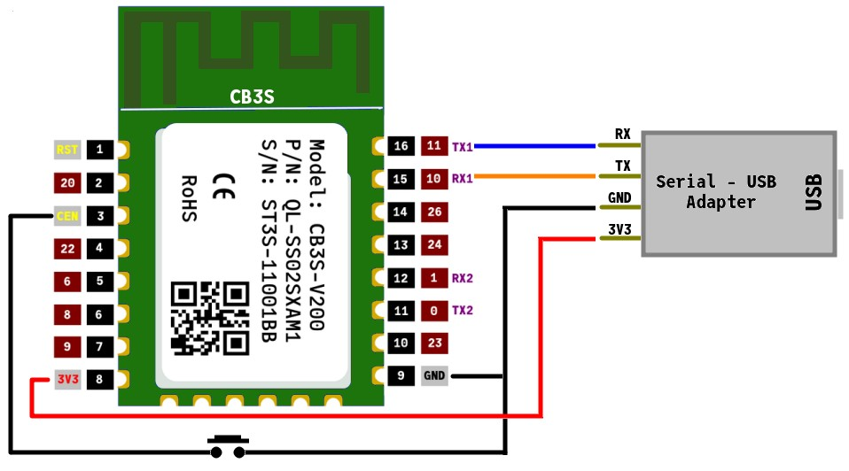
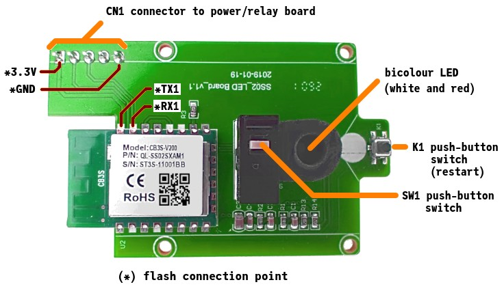
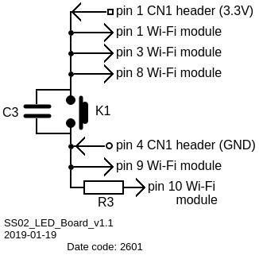
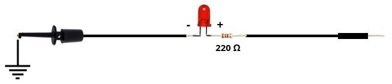

# CB3S-V200-BK7238

**CB3S-V200: Tuya Wi-Fi Module based on BK7238**

---

Last update: 2026-07-22, initial release: 2026-07-16.

The module was found in Treatlife SS02S Single Pole Wall Switches purchased in June 2026.

---


It would not be practical to include in the diagram all the macros and static variables assigned to the BK7238 I/O pins in the [libretiny](https://github.com/libretiny-eu/libretiny) generic bk7238 board definitions. The following tables present them in a somewhat logical manner.

**SPI Interface**:
| PAD | GPIO | Interface macro | Function macro | Arduino macro | Arduino static var |
|:---:|:---: | ---           | ---:           | :---:            | :---:        |
| |    |           |        |             |       |
| 20 | 14 | PIN_SPI0_SCK | PIN_SCK, PIN_P14 | PIN_D8 | D8 |
| 19 | 15 | PIN_SPI0_CS | PIN_CS, PIN_P15 | PIN_D9 | D9 |
| 17 | 17 | PIN_SPI0_MISO | PIN_MISO, PIN_P17 | PIN_D11 | D11 |
| 16 | 16 | PIN_SPI0_MOSI | PIN_MOSI, PIN_P16 | PIN_D10 | D10 |


**I2C Interfaces**:
| PAD | GPIO | Interface macro | Function macro | Arduino macro | Arduino static var |
|:---: |:---: | ---           | ---:           | :---:            | :---:        |
| |    |           |        |             |       |
| 19 | 15 | PIN_WIRE2_SCL_0 | PIN_P15 | PIN_D9 | D9 |
| 17 | 17 | PIN_WIRE2_SDA_0 | PIN_P17 | PIN_D11 | D11 |
| 14 | 26 | PIN_WIRE2_SDA_1 | PIN_P26 | PIN_D17 | D17 |
| 13 | 24 | PIN_WIRE2_SCL_1 | PIN_P24 | PIN_D16 | D16 |


**Serial Interfaces**:
| PAD | GPIO | Interface macro | Function macro | Arduino macro | Arduino static var |
|:---: |:---: | ---           | ---:           | :---:            | :---:        |
|    |    |           |        |             |       |
| 16 | 11 | PIN_SERIAL1_TX | PIN_TX1, PIN_P11 | PIN_D7 | D7 |
| 15 | 10 | PIN_SERIAL1_RX | PIN_RX1, PIN_P10 | PIN_D6 | D6 |
| 12 | 1 | PIN_SERIAL2_RX | PIN_RX2, PIN_P1 | PIN_D1 | D1 |
| 11 | 0 | PIN_SERIAL2_TX | PIN_TX2, PIN_P0 | PIN_D0 | D0 |
|  

**Analog Inputs**:
| PAD | GPIO | Function macro | Arduino macro | Arduino static var |
|:---: |:---: | ---:           | :---:            | :---:        |
|  |    |        |             |       |
| 15 | 10 | PIN_ADC6, PIN_P10 | PIN_A1 | A1 |
| 14 | 26 |PIN_ADC1, PIN_P26 | PIN_A4 | A4 |
| 13 | 24 | PIN_ADC2, PIN_P24 | PIN_A3 | A3 |
| 12 | 1 | PIN_ADC5, PIN_P1 | PIN_A0 | A0 |
| 2  | 20 | PIN_ADC3, PIN_P20 | PIN_A2 | A2 |
|    | 28 | PIN_ADC4, PIN_P28 | PIN_A5 | A5 |

**PWM Outputs**:
| PAD | GPIO | Function macro | Arduino macro |
|:---: |:---: | ---:           | :---:            |
|  |    |        |             |
| 5 | 6 | PIN_PWM0, PIN_P6 | PIN_D2 |
| 21 | 7 | PIN_PWM1, PIN_P7 | PIN_D3 |
| 6 | 8 | PIN_PWM2, PIN_P8 | PIN_D4 |
| 7 | 9 | PIN_PWM3, PIN_P9 | PIN_D5 |
| 13 | 24 | PIN_PWM4, PIN_P24 | PIN_D16 |
| 14 | 26 | PIN_PWM5 , PIN_P26 | PIN_D17 |
 

References:
  - [BK7238 datasheet](https://datasheet4u.com/pdf/1563396/BK7238.pdf)
  - [generic-bk7238.json](https://github.com/libretiny-eu/libretiny/blob/master/boards/generic-bk7238.json) and [generic-bk7238-tuya.h](https://github.com/libretiny-eu/libretiny/blob/master/boards/variants/generic-bk7238-tuya.h)


## Flashing

If the module is on its own, then presumably the following could be used to upload new firmware from the Platformio IDE extension.



On clicking the **pioarduino: Upload** icon in the extension: 

```
Uploading .pio/build/bk7238/firmware.uf2
|-- Detected file type: UF2 - CB3S-V200-BK7238 26.07.17
|-- Connecting to 'Beken 7238' on /dev/ttyUSB0 @ 115200
|-- Connect UART1 of the BK7231 to the USB-TTL adapter:
|   
|       --------+        +--------------------
|            PC |        | BK7231             
|       --------+        +--------------------
|            RX | ------ | TX1 (GPIO11 / P11) 
|            TX | ------ | RX1 (GPIO10 / P10) 
|               |        |                    
|           GND | ------ | GND                
|       --------+        +--------------------
|    
|-- Using a good, stable 3.3V power supply is crucial. Most flashing issues
|-- are caused by either voltage drops during intensive flash operations,
|-- or bad/loose wires.
|    
|-- The UART adapter's 3.3V power regulator is usually not enough. Instead,
|-- a regulated bench power supply, or a linear 1117-type regulator is recommended.
|    
|-- To enter download mode, the chip has to be rebooted while the flashing program
|-- is trying to establish communication.
|-- In order to do that, you need to bridge CEN pin to GND with a wire.
```

As can be seen, the CEN pin must be shorted to ground to put a BK72xx chip into firmware download mode. 

When flashing the BK7238 *in situ* on the `SS02_LED Board_v1.1` of the Treatlife Wi-Fi switch, grounding the CEN switch will probably fail.



That may be because shorting the CEN pin to ground, which amounts to pressing the K1 push-button restart switch, will also bridge the 3.3 volts and ground rails of the board.



In turn, that will short the 3.3V and GND connections of the serial-USB adapter most likely disabling it. The solution is to power the `LED board` with an independent 3.3 volt supply (psu). Do not forget to connect the psu ground to the `LED board` and the serial-USB adapter grounds and to remove the 3.3 volt connection between the `LED board` and the serial-USB adapter.

## PlatformIO Test Project 

All but two BK7238 GPIO pins are connected to pads on the three of the outer edges of the CB3S-V200 module. The two omitted GPIO pins are 21 and 28. The PlatformIO project [main.cpp](src/main.cpp) can verify the mapping of the remaining 17 BK7238 GPIO pins to the module pads. Use a simple probe 



to check that each pad along the edges of the module is flashed on and off in turn. The corresponding GPIO pin number is shown in the serial monitor as the test proceeds. Pads are tested in counterclockwise physical order:  down the left edge, across the bottom edge and up the right edge of the module oriented as shown above.

Macros at the start of the source code can be modified to slow down or speed up the test.

```C
//-----------------------------------/
// User defined parameters
//
#define TOGGLE_TIME 30000 // time in milliseconds that a GPIO pin is toggled ON and OFF
//
#define LOW_TIME      100 // time in milliseconds the GPIO pin is set LOW when toggling it
//
#define HIGH_TIME     200 // time in milliseconds the GPIO pin is set HIGH when toggling it
//
#define TEST_DELAY   5000 // time in milliseconds between tests
//
//----------------------------------/
```

Given the project configuration file, [platformio.ini](./platformio.ini), will ensure that the required [libretiny](https://github.com/libretiny-eu/libretiny) toolchain is loaded before compilation begins.

```ini
[env:bk7238]
board = generic-bk7238-tuya
platform = libretiny
framework = arduino      
```

The `generic-bk72§38-tuya` board definition is used because **libretiny** does not contain a variant `c3bs-v200` board definition.
