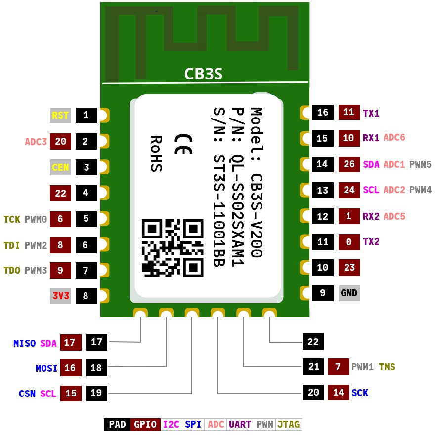

# CB3S-V200-BK7238

**CB3S-V200: Tuya Wi-Fi Module based on BK7238**

---

2026-07-16

Module Found in Treatlife SS02S Single Pole Wall Switch

---




References:
  - [BK7238 datasheet](https://datasheet4u.com/pdf/1563396/BK7238.pdf)
  - [generic-bk7238.json](https://github.com/libretiny-eu/libretiny/blob/master/boards/generic-bk7238.json) and [generic-bk7238-tuya.c](https://github.com/libretiny-eu/libretiny/blob/master/boards/generic-bk7238.json)


## Flashing

If the module is on its own, then presumably the following could be used to upload new firmware from the Platformio IDE extension.


On clicking the **pioarduino: Upload** icon in the extension: 

```
Uploading .pio/build/bk7238/firmware.uf2
|-- Detected file type: UF2 - CB3S-V200-BK7238 26.07.17
|-- Connecting to 'Beken 7238' on /dev/ttyUSB0 @ 115200
|-- Connect UART1 of the BK7231 to the USB-TTL adapter:
|   
|       --------+        +--------------------
|            PC |        | BK7231             
|       --------+        +--------------------
|            RX | ------ | TX1 (GPIO11 / P11) 
|            TX | ------ | RX1 (GPIO10 / P10) 
|               |        |                    
|           GND | ------ | GND                
|       --------+        +--------------------
|    
|-- Using a good, stable 3.3V power supply is crucial. Most flashing issues
|-- are caused by either voltage drops during intensive flash operations,
|-- or bad/loose wires.
|    
|-- The UART adapter's 3.3V power regulator is usually not enough. Instead,
|-- a regulated bench power supply, or a linear 1117-type regulator is recommended.
|    
|-- To enter download mode, the chip has to be rebooted while the flashing program
|-- is trying to establish communication.
|-- In order to do that, you need to bridge CEN pin to GND with a wire.
```

As can be seen, the CEN pin must be shorted to ground to put a BK72xx chip into firmware download mode. 

When flashing the BK7238 *in situ* on the `SS02_LED Board_v1.1` of the Wi-Fi switch, grounding the CEN switch will probably fail.


That is because shorting the CEN pin, which amounts to pressing the K1 push-button restart switch, will also short the 3.3 volts and ground rails of the board.


In turn, that will short the 3.3V and GND connections of the serial-USB adapter and most likely disabling it. The solution is to power the `LED board` with an independent 3.3 volt supply (psu). Do not forget to connect the psu ground to the `LED board` and the serial-USB adapter grounds and to remove the 3.3 volt connection between the `LED board` and the serial-USB adapter.
